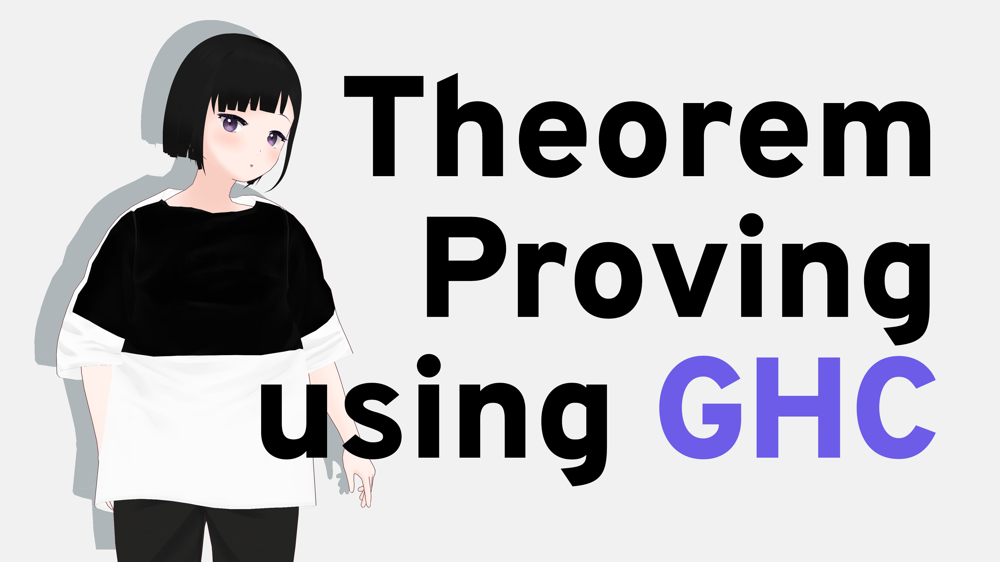

---

## 定理証明（Theorem Proving）ってなに

- プログラムで証明を書くよ
- 数学のツールとして
  - 四色定理
- **プログラムの性質を保証する**
  - テストよりも強い保証

---

## GHC ってなに

- Glasgow Haskell Compiler
- プログラミング言語Haskellのコンパイラの一つ
  - 今はほぼこれ以外のコンパイラが使われていない
- このスライドに登場するHaskellのコードは
  GHC専用の言語拡張がふんだんに使われている
  - ので、今日の話はGHC特有の話でHaskellには適用されないことが多い

---

## なんで証明できるの

- Curry-Howard Correspondence
- 型が命題、プログラムが証明に対応する
- ある型 `T` がつくプログラム `e1 :: T` が存在するとき、 `e1` は `T` 型のプログラムが存在することの証明
  - `T` is inhabited by `e1`
  - もちろん `e2 :: T` となる `e1` とは異なる `e2` が存在してもよい
    - 証明はひとつではない
  - `T` を命題、`e1, e2` を `T` が真であることの証明ととらえることができる
- ここでいう命題は直観主義論理という体系
  - だいたい古典論理だけど排中律とかが成り立たない

---

## 型がつくならどんなプログラミング言語でも定理証明できる？

命題論理を型レベルで表現するためのツール

- 直積型 `T1 * T2`: 論理積 $T1 \land T2$
  - タプルというやつ
- 直和型 `T1 + T2`: 論理和 $T1 \lor T2$
  - `Either`, `Result` など？
- 関数型 `T1 -> T2`: 含意 $T1 \to T2$
  - 意外とこれがない場合が多い
- ボトム型 `Void`: 偽 $\bot$
  - `absurd :: forall a. Void -> a`
  - $\bot \to P$ は恒真！

---

## それで足りる？

- 真 $\top$ は...値が作れる型ならばなんでもよし！
- 否定 $\lnot P$はボトム型と関数型からつくれる
  - $P \to \bot = \lnot P \lor \bot = \lnot P$

---

## 単純な例なら...

- 三段論法 $(P \to Q) \land (Q \to R) \to (P \to R)$

```typescript
// TypeScript
function syllogism<P, Q, R>([h1, h2]: [(p: P) => Q, (q: Q) => R]): (p: P) => R {
  return (x: P) => h2(h1(x));
}
```

- 爆発原理 $\bot \to P$

```rust
// Rust
enum Void {}
fn ex_falso<P>(x: Void) -> P {
   match x {}
}
```

---

## 量化子

- 一階述語論理で量化するのは **項**
  - e.g. すべての自然数 $n$ について...
  - 項が命題に出現
    - 値が型に出現
    - **依存型**
- 依存直積 $\prod_{x \in T} P(x)$: 全称量化 $\forall x \in T. \; P(x)$
  - `A -> B` の `B` に `x :: A` が出現したら `pi (x :: A). B`
- 依存直和 $\sum_{x \in T} P(x)$: 存在量化 $\exists x \in T. \; P(x)$
  - `(A, B)` の `B` に `x :: A` が出現したら `sigma (x :: A). B`

---

## 等しさの証明

- 命題が真である = ある型の値が存在する
- ところで、値について論じれるなら二つの値が等しいかどうかを証明したくなる
- 「値が存在すること」と「二つの型（値）が等しい」をむずびつけるには...
- 「二つの型が等しいとき、かつその時に限り存在する値」があればいい
  * **Propositional Equality**, その型をIdentity Type

---

## Propositional equality, using type equality constraint

```haskell
-- implemented in 'Data.Type.Equality'
data a :~: b where
  Refl :: a :~: a

sym :: a :~: b -> b :~: a
sym Refl = Refl         -- GHC can infer symmetricity

trans :: a :~: b -> b :~: c -> a :~: c
trans Refl Refl = Refl  -- GHC can infer transitivity
```

- **GADTs** (*Generalized Algebraic Datatypes*) という言語機能を活用
- `a :~: b` 型の値を `Refl` コンストラクタを用いて作る
- ただし、`Refl` コンストラクタは型同値性 `a ~ b` を要求
  - `a` と `b` が等しいとGHCが判断したら、 `a ~ b` を解消する
  - 単一化による解消だけではなく、**型族** (*Type Family*) で等しさを定義できる

---

## Propositional equality, using type equality constraint

```haskell
-- ok
intIsInt :: Int :~: Int
intIsInt = Refl

-- 型族で追加の公理を定義
type family F a where
  F Int = Bool
  F [x] = F x

-- ok
proof :: F [Int] :~: Bool
proof = Refl

-- 型エラー！
-- intIsNotBool :: Int :~: Bool
-- intIsNotBool = Refl
```

---

## （参考）ほかに Propositional equality

Leibnizian Equality

```haskell
-- implemented in 'Data.Eq.Type' from 'eq' package by Edward A. Kmett
data a :~: b = Equ { subst :: forall c. c a -> c b }

refl :: a :~: a
refl = Equ id

trans :: a :~: b -> b :~: c -> a :~: c
trans (Equ subst1) (Equ subst2) = Equ (subst2 . subst1)

data Sym p a b = Sym { unSym :: p b a }

sym :: a :~: b -> b :~: a
sym h = unSym (subst h (Sym refl))
```

---

## 依存型プログラミング言語での定理証明

$\forall n \in \text{Nat}. \; n = n + 0$

```haskell
-- Idris
-- さっきの `:~:` が Idris では `=`
-- ↓ これは依存直積 pi (n :: Nat). n = plus n Z
plusZ : (n : Nat) -> n = plus n Z
plusZ Z = Refl                  -- n = Z の場合、plus Z Z は Z なのでok
plusZ (S n') = cong (plusZ n')  -- n = S n' の場合、S n' = plus (S n') Z を示す
```

- `cong : a = b -> f a = f b`
  - `plusZ n' : n' = plus n' Z`
  - `cong (plusZ n') : S n' = S (plus n' Z)`
- 型レベルの項 `n` について項レベルでcase analysisできているのがポイント

---

## 依存型がなくても...できるかも

- まず型レベルの全称量化があって
  - `forall a. T`
- まず一階述語論理の項を型でエミュレートして
  - ```haskell
    data Z
    data S n
    ```
- case analysisのために↑で作った型レベルの項を値に対応させる
  - 各ケースに対応した値を用意
  - これはさっきもでてきたGADTsで可能に...

---

## Haskell（GHC）でやるんやおれは

```haskell
-- 型レベル自然数を定義
-- Note: DataKinds を使うと data Nat = Z | S Nat
data Z
data S n

-- 型レベル自然数に対応する値を定義！
-- シングルトン (singletons) と Haskell の世界では呼ばれる
data SNat n where
  SZ :: SNat Z
  SS :: SNat n -> SNat (S n)

-- SZ         :: SNat Z
-- SS (SS SZ) :: SNat (S (S Z))
```

- `SS (SS SZ) :: SNat Z` は存在しえない！
- `SNat n` の `n` の構造が値レベルで反映されている！

---

## 証明や！

```haskell
-- 型レベル足し算
type family a + b where
  Z + b = b
  S a' + b = S (a' + b)

-- 上の足し算の定義を後で使いやすいように定理にする
plus_Z_left :: SNat n -> Z + n :~: n
plus_Z_left _ = Refl
plus_Sn_m :: SNat n -> SNat m -> S n + m :~: S (n + m)
plus_Sn_m _ _ = Refl
```

---

## GADTs Revisited

- **型レベル** の `n` に対して **値レベル** でパターンマッチできる！
- 下の例では型レベルの `a` と値レベルの `a'` はまるで別物
- でも構造が反映されているので
  - 型レベルの `n` で命題を書き
  - 値レベルの `SNat n` でcase analysisで証明を書くことができる

```haskell
plus_Z_right :: SNat a -> a + Z :~: a
plus_Z_right SZ      = plus_Z_left SZ
plus_Z_right (SS a') = trans (plus_Sn_m a' SZ) (cong (plus_Z_right a'))
```

---

- 足し算の可換律と結合律の証明
- 導出木を式でエンコードする感じになる

```haskell
plus_comm :: SNat n -> SNat m -> n + m :~: m + n
plus_comm SZ m = trans (plus_Z_left m) (sym (plus_Z_right m))
plus_comm (SS n') m =
  trans (plus_Sn_m n' m) (trans (cong (plus_comm n' m)) (sym (plus_n_Sm m n')))

plus_assoc :: SNat a -> SNat b -> SNat c -> a + (b + c) :~: (a + b) + c
plus_assoc SZ b c = trans
  (plus_Z_left (b + c))
  (sym (cong_plus_right (SZ + b) b c (plus_Z_left b)))
plus_assoc (SS a') b c = trans
  (plus_Sn_m a' (b + c))
  (trans (trans (cong (plus_assoc a' b c)) (sym (plus_Sn_m (a' + b) c)))
         (cong_plus_right (SS (a' + b)) (SS a' + b) c (sym (plus_Sn_m a' b)))
  )
```

---

- 掛け算の結合律の証明

```haskell
distr_plus_mult
  :: SNat a -> SNat b -> SNat c -> (a + b) * c :~: (a * c) + (b * c)
distr_plus_mult a b SZ = trans
  (mult_Z_right (a + b))
  (sym
    (trans (cong_plus_right (a * SZ) SZ (b * SZ) (mult_Z_right a))
           (trans (plus_Z_left (b * SZ)) (mult_Z_right b))
    )
  )
distr_plus_mult a b (SS c') = trans
  (trans
    (mult_n_Sm (a + b) c')
    (cong_plus_left ((a + b) * c')
                    ((a * c') + (b * c'))
                    (a + b)
                    (distr_plus_mult a b c')
    )
  )
  (sym
    (trans
      (trans
        (trans
          (trans
            (trans
              (trans
                (cong_plus_right (a * SS c')
                                 (a + (a * c'))
                                 (b * SS c')
                                 (mult_n_Sm a c')
                )
                (cong_plus_left (b * SS c')
                                (b + (b * c'))
                                (a + (a * c'))
                                (mult_n_Sm b c')
                )
              )
              (sym (plus_assoc a (a * c') (b + (b * c'))))
            )
            (cong_plus_left ((a * c') + (b + (b * c')))
                            (((a * c') + b) + (b * c'))
                            a
                            (plus_assoc (a * c') b (b * c'))
            )
          )
          (cong_plus_left
            (((a * c') + b) + (b * c'))
            ((b + (a * c')) + (b * c'))
            a
            (cong_plus_right ((a * c') + b)
                             (b + (a * c'))
                             (b * c')
                             (plus_comm (a * c') b)
            )
          )
        )
        (sym
          (cong_plus_left (b + ((a * c') + (b * c')))
                          ((b + (a * c')) + (b * c'))
                          a
                          (plus_assoc b (a * c') (b * c'))
          )
        )
      )
      (plus_assoc a b ((a * c') + (b * c')))
    )
  )

mult_assoc :: SNat a -> SNat b -> SNat c -> a * (b * c) :~: (a * b) * c
mult_assoc SZ b c = trans
  (trans (mult_Z_left (b * c)) (sym (mult_Z_left c)))
  (cong_mult_right SZ (SZ * b) c (sym (mult_Z_left b)))
mult_assoc (SS a') b c = trans
  (trans
    (mult_Sn_m a' (b * c))
    (cong_plus_left (a' * (b * c)) ((a' * b) * c) (b * c) (mult_assoc a' b c))
  )
  (sym
    (trans (cong_mult_right (SS a' * b) (b + (a' * b)) c (mult_Sn_m a' b))
           (distr_plus_mult b (a' * b) c)
    )
  )
```

---

<!-- _footer: Copyright 2020 Twitter, Inc and other contributors. [CC-BY 4.0](https://creativecommons.org/licenses/by/4.0/) -->

## オエー

なにがやりたいねん


---

## Motivation

- Haskell (GHC) が定理証明ができるギリギリっぽいので
  その境界線を探ることでなんか理解を深めたかった
- 定理証明は証明支援系でやろうね！！
   - Coq
   - Agda
   - Idris
     - 証明のための機能も入ってるっぽい

---

## まとめ

- それぞれ命題の言語に対応する型があれば証明が書けそう
  - 命題論理: 直積型、直和型、関数型など
  - 一階述語論理: 依存直積型、依存直和型
  - （二階述語論理: 多相型）
- Propositional Equalityを実現することができれば、等しさの証明ができそう
  - GADTs (type equality constraint in GHC)
  - Leibnizian Equality
- 依存型がなくても、GADTsでsingletonを実現すればほぼ同等のことができそう
  - 依存型があれば項レベルの式に対する証明が書けるがこの方法ではできない
  - 型レベルの式に対する証明はできる！

---


